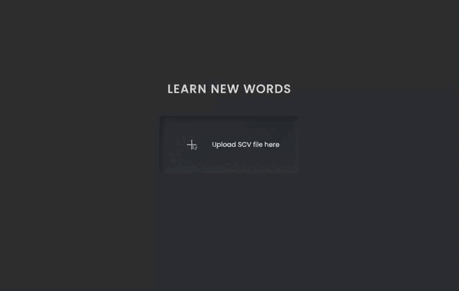

## Words Memorizer Application

The application transforms [Google Translate's](https://translate.google.com/saved) saved words into flipping cards.

## How To Use

1. Import your saved words from Google Translate Saved tab to Google Sheets (Only available on the Desktop version).
2. Download Google Sheets file as CSV (File -> Download -> Comma Separated Values)
3. Upload CSV file to app website.

## Technologies

Project is created with:

- JavaScript ES6
- SASS version: 1.52.3

## Resources

- [Papa Parse](https://www.papaparse.com/) - The powerful, in-browser CSV parser for big boys and girls.
- [ionicons](https://ionic.io/ionicons) - Open source icons.
- [Neumorphism.io](https://neumorphism.io/#e0e0e0) -Generate Soft-UI CSS code.

## TODO

- Add drag and drop
- Add leave session functionality to export an updated CSV file without remembered words.
- Use Meriam-Webster API to add words definitions, phonetics and pronunciation.
- User sign up and login.
- Timer.
- Tile memory game for saved words.
